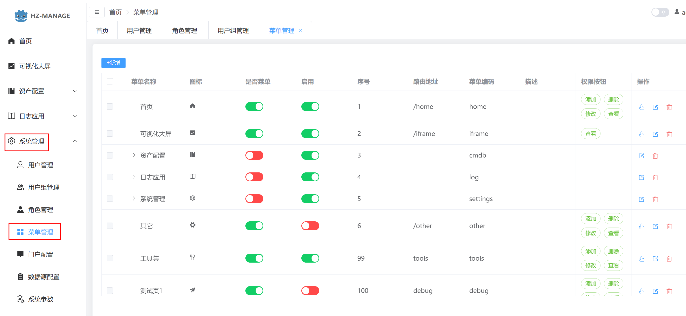
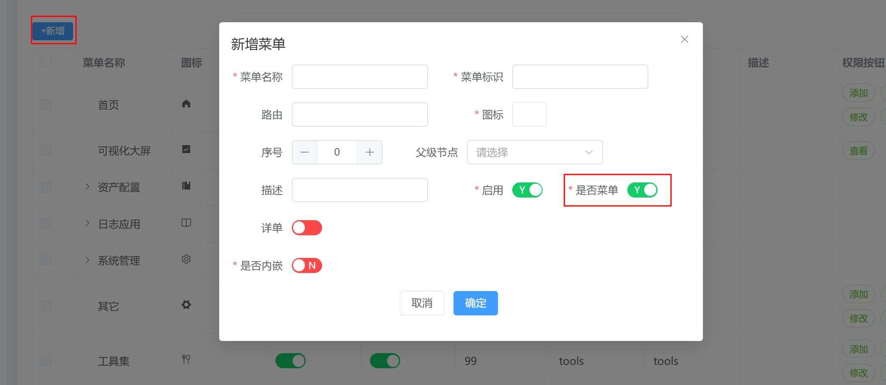
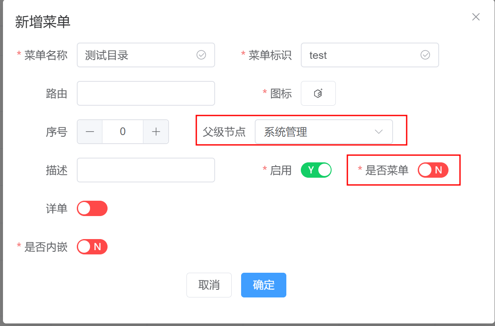
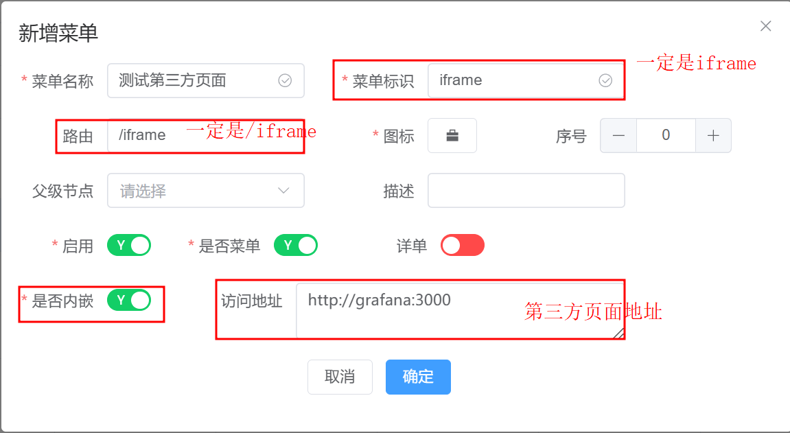

菜单管理一般只使用到菜单的状态管理、第三方页面嵌入。其它功能为开发时使用的，不建议更改

## 查看菜单

## 新增菜单

1. 新增菜单

   
2. 新增目录

   
3. 新增内嵌菜单（第三方页面）

   支持以iframe内嵌的方式嵌入第三方页面。

   > 菜单标识：iframe    路由：/iframe   是否内嵌：YES   访问地址：填写实际的地址
   >

   
