可以为用户分配给多个角色和用户组，同时用户组也可以关联多个角色。

角色与菜单、按钮权限关联。

## 用户

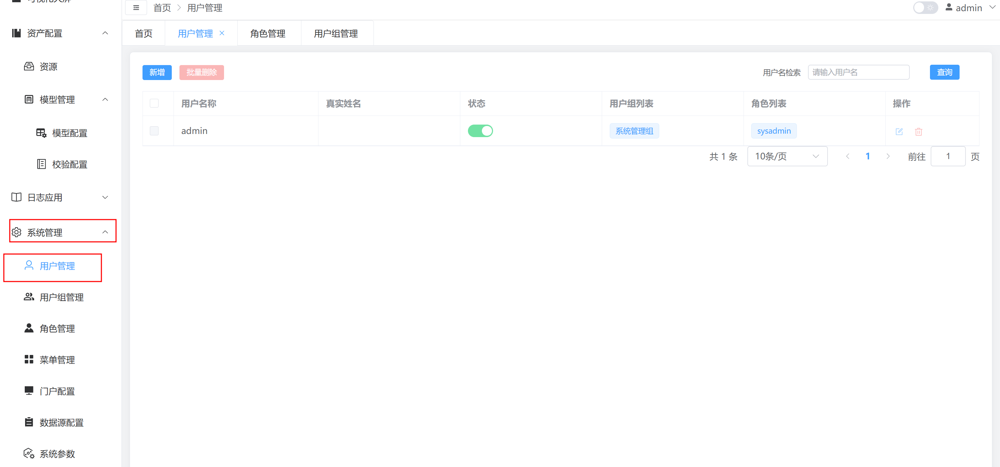

### 新增用户

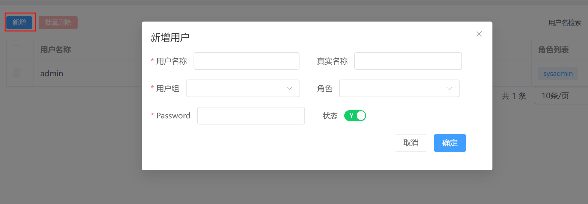

### 编辑用户

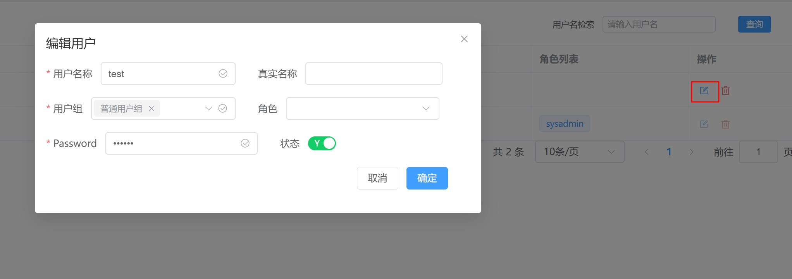

### 删除用户

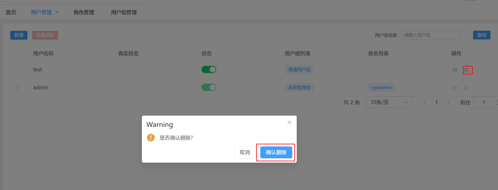

## 用户组

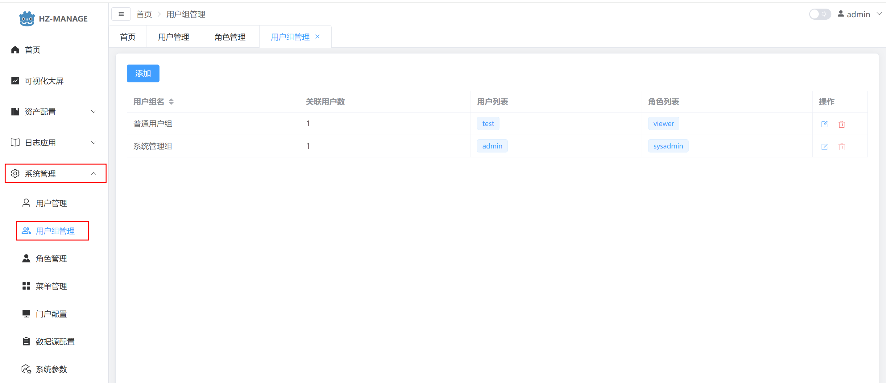

### 新增用户组

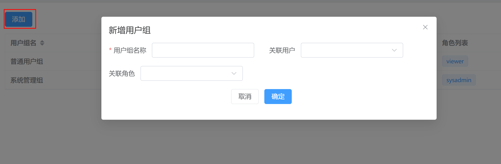

### 编辑用户组

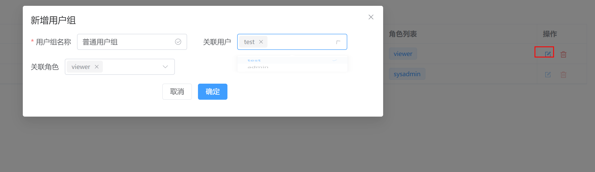

### 删除用户组

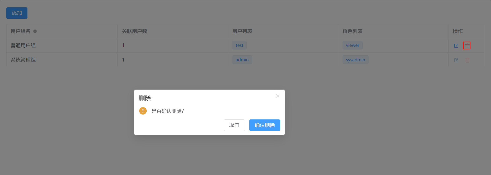

## 角色

角色核心用法在于可分配所需的菜单和权限

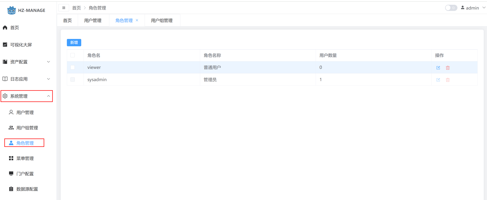

### 新增角色

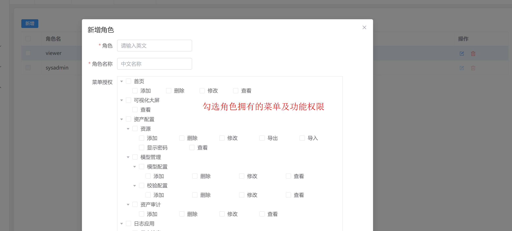

### 编辑角色

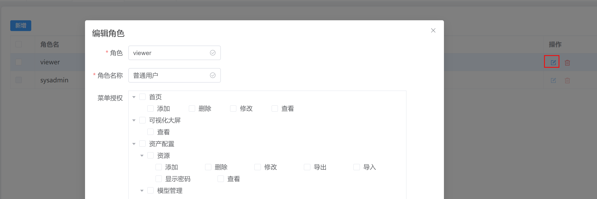

### 删除角色

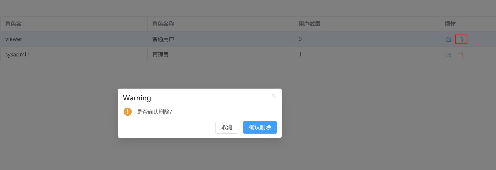
