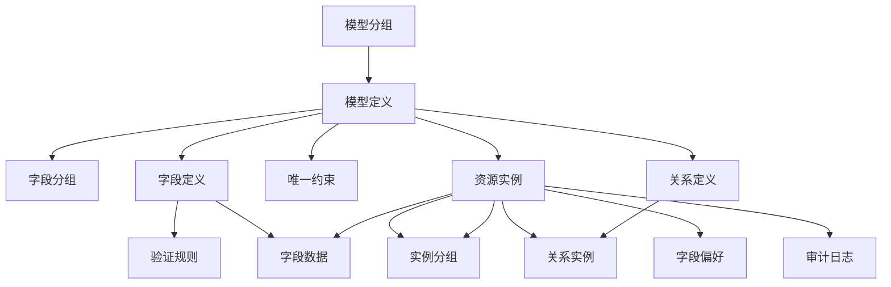

## 概述

CMDB（Configuration Management Database，配置管理数据库）是企业运维管理平台的核心模块，基于模型驱动的资产管理理念，提供灵活的资产建模、实例管理、关联关系管理和审计追溯能力。

### 核心价值

- **模型驱动架构**：通过自定义模型适应不同企业的资产结构
- **灵活扩展**：支持自定义字段、验证规则和关联关系
- **全生命周期管理**：覆盖资产从创建到删除的完整生命周期
- **审计追溯**：记录所有变更历史，支持故障追溯和合规审计
- **可视化拓扑**：通过关系图展示资产间的依赖和连接

### 模块定位

CMDB 是运维管理平台的基础设施，为其他模块提供资产数据支撑：

- **节点管理**：依赖 CMDB 中的服务器实例
- **任务调度**：引用 CMDB 中的目标资产
- **监控告警**：基于 CMDB 资产配置监控规则
- **权限控制**：基于资产分组实现细粒度权限

## 架构设计

### 数据模型层次结构

CMDB 采用四层架构设计：

```
┌─────────────────────────────────────────────────────────────┐
│                     系统功能层                               │
│  ├─ 字段偏好  ├─ 密码管理  ├─ 系统缓存  ├─ 审计日志          │
└─────────────────────────────────────────────────────────────┘
                              ↑
┌─────────────────────────────────────────────────────────────┐
│                     关系管理层                               │
│  ├─ 关系定义  ├─ 关系实例  ├─ 拓扑可视化                      │
└─────────────────────────────────────────────────────────────┘
                              ↑
┌─────────────────────────────────────────────────────────────┐
│                     实例管理层                               │
│  ├─ 资源实例  ├─ 实例分组  ├─ 空闲池  ├─ 导入导出  ├─ 检索    │
└─────────────────────────────────────────────────────────────┘
                              ↑
┌─────────────────────────────────────────────────────────────┐
│                     模型定义层                               │
│  ├─ 模型分组  ├─ 模型定义  ├─ 字段配置  ├─ 验证规则  ├─ 唯一约束│
└─────────────────────────────────────────────────────────────┘
```

### 核心概念

理解以下核心概念是使用 CMDB 的基础：

#### 1. 模型组（Model Group）

模型的逻辑分类，用于组织和管理模型。

- **内置分组**：系统预置的分组（如"基础模型"、"应用模型"）
- **自定义分组**：用户创建的分组
- **用途**：在模型列表中按组展示，便于查找

#### 2. 模型（Model）

资产的抽象定义，描述一类资产的共同属性。

- 示例：服务器模型、数据库模型、机房模型
- 组成：字段定义、验证规则、实例名称模板
- 属性：名称、显示名称、图标、描述

::: tip 模型与实例的关系
模型类似于面向对象编程中的"类"，实例则是类的具体"对象"。
:::

#### 3. 字段（Field）

模型的具体属性定义。

- **字段类型**：string/text/boolean/enum/json/integer/float/password/date/datetime/model_ref
- **字段属性**：是否必填、是否可编辑、默认值、验证规则
- **字段分组**：将相关字段组织在一起，便于展示

#### 4. 字段组（Field Group）

模型内字段的逻辑分组。

- **用途**：在实例详情页中将字段分组展示
- **示例**：基本信息、硬件配置、网络配置

#### 5. 实例（Instance）

模型的具体数据对象。

- **实例名称**：根据模板自动生成或手动录入
- **实例分组**：可以属于多个分组（多对多关系）
- **输入模式**：手动录入、表格导入、自动发现

#### 6. 实例分组（Instance Group）

实例的逻辑分组，支持树形结构。

- **树形结构**：支持多级嵌套（如：生产环境 → Web 应用 → 服务器）
- **空闲池**：每个模型都有内置的"空闲池"分组
- **多对多关系**：一个实例可以属于多个分组

#### 7. 关系（Relation）

模型或实例之间的关联定义。

- **关系定义**：定义两个模型间的关系类型和规则
- **关系实例**：具体实例间的关联
- **拓扑类型**：有向图、无向图、有向无环图

## 数据模型全景

CMDB 包含 13 个核心数据模型：

### 模型定义层（5 个）

| 模型 | 说明 | 关键字段 |
|------|------|----------|
| ModelGroups | 模型分组 | name, verbose_name, built_in, editable |
| Models | 模型定义 | name, verbose_name, instance_name_template, model_group |
| ModelFieldGroups | 字段分组 | name, verbose_name, model |
| ModelFields | 字段定义 | name, verbose_name, type, required, validation_rule |
| ValidationRules | 验证规则 | name, type, field_type, rule |

### 实例管理层（4 个）

| 模型 | 说明 | 关键字段 |
|------|------|----------|
| ModelInstance | 资源实例 | model, instance_name, input_mode |
| ModelFieldMeta | 字段数据 | model_instance, model_fields, data |
| ModelInstanceGroup | 实例分组 | label, model, parent, path |
| ModelInstanceGroupRelation | 分组关联 | instance, group |

### 关系管理层（2 个）

| 模型 | 说明 | 关键字段 |
|------|------|----------|
| RelationDefinition | 关系定义 | name, topology_type, source_model, target_model |
| Relations | 关系实例 | source_instance, target_instance, relation |

### 系统功能层（2 个）

| 模型 | 说明 | 关键字段 |
|------|------|----------|
| UniqueConstraint | 唯一约束 | model, fields, validate_null |
| ModelFieldPreference | 字段偏好 | model, fields_preferred |

## 模块关系图



## 功能导航

| 文档 | 说明 |
|------|------|
| [模型分组](./model-group.md) | 管理模型的逻辑分组 |
| [模型管理](./model.md) | 创建和管理资产模型 |
| [字段配置](./field.md) | 配置模型字段及属性 |
| [校验配置](./validation.md) | 定义数据验证规则 |
| [唯一性约束](./unique-constraint.md) | 设置字段唯一性约束 |
| [资源实例](./instance.md) | 管理资产实例数据 |
| [实例分组](./instance-group.md) | 组织实例的树形分组 |
| [资源检索](./search.md) | 查询和筛选资产 |
| [导入导出](./import-export.md) | 批量数据操作 |
| [关联关系](./relation.md) | 管理资产间的关联 |
| [资产审计](./audit.md) | 查看变更历史 |
| [字段偏好](./field-preference.md) | 个性化字段显示 |
| [密码管理](./password.md) | 密字段安全配置 |
| [系统维护](./system.md) | 缓存和性能管理 |
| [最佳实践](./best-practices.md) | 使用建议和 FAQ |

## 快速开始

### 典型使用流程

以下是一个创建服务器资产并建立关联的完整流程：

#### 1. 创建模型

```bash
# 在模型管理中创建"服务器"模型
- 名称：server
- 显示名称：服务器
- 模型组：基础设施
```

#### 2. 添加字段

```bash
# 为服务器模型添加字段
- 主机名 (string, 必填)
- IP 地址 (string, 必填, IP 验证)
- CPU 核数 (integer, 必填, 范围 1-128)
- 内存 (integer, 必填, 单位 GB)
- 操作系统 (enum, 必填)
- 所属机房 (model_ref, 引用机房模型)
```

#### 3. 配置验证规则

```bash
# 为 IP 地址字段配置验证
- 类型：ipv4
- 确保每个服务器 IP 唯一
```

#### 4. 创建实例

```bash
# 创建服务器实例
- 主机名：web-server-01
- IP：192.168.1.100
- CPU：8
- 内存：16
- 操作系统：CentOS 7
- 所属机房：北京机房
```

#### 5. 分组管理

```bash
# 将实例添加到分组
- 生产环境 → Web 应用 → 前端服务器
```

#### 6. 建立关联

```bash
# 为服务器建立与应用的关联关系
- 关系类型：部署
- 应用实例：电商网站
- 服务器实例：web-server-01
```

#### 7. 查询和导出

```bash
# 查询生产环境的高配置服务器
- 条件：CPU >= 16 且 内存 >= 32
- 分组：生产环境
- 导出结果用于容量规划
```

### 常见业务场景

#### 场景一：新业务系统资产入库

1. 根据业务需求创建模型（应用、数据库、缓存等）
2. 定义字段和验证规则
3. 通过 Excel 批量导入实例数据
4. 建立实例间的关联关系
5. 按业务线进行分组

#### 场景二：资产变更追溯

1. 在资产审计中查询特定实例
2. 查看变更历史记录
3. 定位变更时间和操作人
4. 如需回滚，参考历史值恢复

#### 场景三：依赖关系分析

1. 在关联关系中查看拓扑图
2. 分析资产间的上下游依赖
3. 评估变更影响范围
4. 生成依赖关系报告

::: tip 推荐学习路径
1. 先阅读 [模型管理](./model.md) 了解如何定义资产结构
2. 再阅读 [资源实例](./instance.md) 学习如何管理资产数据
3. 最后阅读 [关联关系](./relation.md) 掌握资产间的关联配置
:::
